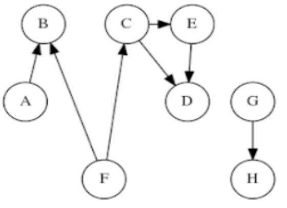

# Ejercicios de tercer parcialito - Taller 2/11/2017

## Del primer recuperatorio tercer parcialito, segundo cuatrimestre de 2012
1. 
	a) Dado un max-heap cualquiera, ¿es posible determinar el orden en que los elementos fueron insertados? ¿En qué orden deben insertarse elementos para lograr la menor cantidad de intercambios?
	b) ¿Puede utilizarse un Heap para implementar un TDA Cola (extraer los elementos en el orden en que fueron insertados)? ¿y para implementar un TDA Pila? Justifique brevemente.

2. Explicar ventajas y desventajas entre la implementación de un heap sobre una lista y sobre un árbol.

## Del primer recuperatorio del cuarto parcialito del segundo cuatrimestre de 2012

3. 
El grado de salida de un vértice perteneciente a un digrafo se define como la cantidad de aristas que salen de él. Implementar una primitiva que dado un grafo G y el vértice V calcule el grado de salida de ese vértice para un grafo implementado con:

	a) Matriz de Adyacencias
	b) Lista de Adyacencias

## Del primer recuperatorio del tercer parcialito, segundo cuatrimestre de 2013

4. Implemente una función que reciba un arreglo con un millón de números y muestre por pantalla el contenido de los 100 elementos mayores. S ́olo se puede recorrer el arreglo de entrada una sola vez y se puede usar cualquiera de las estructuras de datos vistas en clase.

## Del primer recuperatorio del cuarto Parcialito del segundo cuatrimestre de 2013

5. Un árbol no dirigido es un grafo no dirigido que cumple con las siguientes propiedades:

	a) |E| = |V| - 1
	b) Es Acíclico
	c) Es Conexo

Por teorema, si un grafo cumple dos de estas propiedades, será árbol (y por consiguiente, cumplirá la tercera). Haciendo uso de esto (y únicamente de esto), se pide implementar una función que reciba un grafo implementado con lista de adyacencias y determine si se trata o no de un árbol.

## Del tercer parcialito del segundo cuatrimestre de 2014

6. a) Se tiene el siguiente vector de enteros: [8, 12, 9, 7, 22, 3, 26, 14]. Muestre cada paso de aplicar heapify sobre el vector, dibujando el arbol para cada paso. El heap es de mínimos. b) ¿Cuál es la ventaja de usar heapify sobre crear un heap vacío y encolar todos los elementos?

## Del segundo recuperatorio del cuarto parcialito del primer cuatrimestre de 2016

7. La teoría de los 6 grados de separación dice que una persona en la Tierra puede estar conectado a cualquier otra persona a través de una cadena de conocidos que no tiene más de cinco intermediarios. Suponiendo que se tiene un grafo no dirigido G en el que cada vértice es una persona, y cada arista conecta la gente que se conoce:

	a) Implementar un algoritmo para comprobar si se cumple tal teoría para todo el conjunto de personas representadas en el grafo G.
	b) Suponiendo que en el grafo G no habrán altas ni bajas de vértices, pero podrían haberlas de aristas (la gente se va conociendo). Explicar qué ventajas y qué desventajas tendría implementar el grafo G con una matriz de adyacencias.

## Del segundo recuperatorio del cuarto parcialito del segundo cuatrimestre de 2014

8. Un orden topológico de un grafo G es un ordenamiento líneal de los vértices tal que si existe una arista (u,v) en G, u aparece antes que v en el ordenamiento.

	a) Proponga un orden tópológico para el siguiente grafo.
	b) ¿Qué condiciones debe cumplir G para poder calcularle un orden topológico?

	
