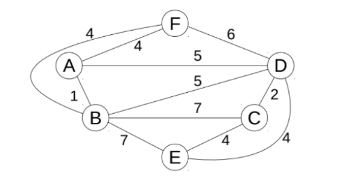
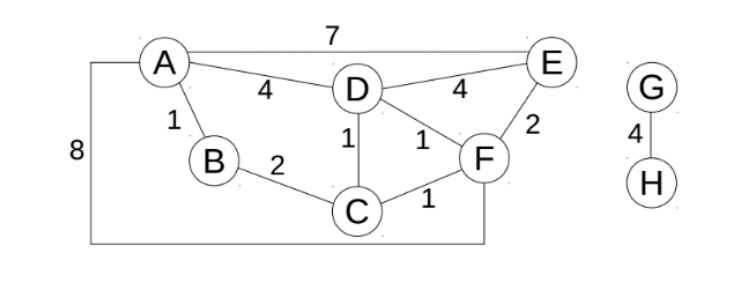

# Ejercicios de cuarto parcialito - Taller 29/11/2017

## Del primer recuperatorio cuarto parcialito, primer cuatrimestre de 2017
2.&nbsp;Implemente el pseudocódigo de un algoritmo de backtracking que resuelva el problema de las 8 Reinas (colocar 8 reinas en un tablero de 8x8 de manera que no se amenacen entre ellas). Puede considerar que ya posee programada la función es_valida() que recibe una solución parcial e indica si la misma es valida.

Ayuda: puede representar la solución con un arreglo. Ejemplo: [ 4, 6, 8, 2, 7, 1, 3, 5 ] indica que las reinas fueron colocadas en las posiciones [(1, 4), (2, 6), (3, 8)], etc.

3.&nbsp;Usted es dueño de unos barcos pesqueros que en este momento están en el mar. Como el Servicio Meteorológico Nacional ha anunciado una fuerte tormenta para esta noche, debe refugiarlos en sus muelles lo más rápido posible.

Se quiere generalizar esta solución para una cantidad n de barcos y m de mulles. Sabiendo que el muelle i puede almacenar M[i] barcos, y que la distancia entre el muelle i y el barco j es D[i][j], implementar el pseudocódigo de un algoritmo greedy que decida en qué muelle se debe almacenar cada barco minimizando la distancia total a recorrer.

¿Qué orden tiene el algoritmo?

## Del coloquio tomado el 01/07/2016

En este barrio todos viven alrededor de la plaza y los vecinos contiguos se odian entre sí. Hay N vecinos y el primer vecino es contiguo con el último. Cuando le preguntan a cada uno cuánto es lo máximo que va a donar para arreglar la plaza la respuesta se registra en el array donar = [d0, d1, …, d(N-1)], pero la condición es: solo donaré si no dona ninguno de mis vecinos contiguos. Usando programación dinámica resolver cuánto es lo máximo que se puede recolectar por donaciones.

**Nota: Lo resolveremos considerando que el primer vecino y el último no son contiguos. En caso de sobrar tiempo resolveremos el caso circular**

## Del cuarto parcialito, primer cuatrimestre de 2017

3.&nbsp;Hannah está _muy_ triste porque el primero de julio un conocido servicio de streaming dejará de transmitir varias series que a ella le interesaban ver. Sin embargo, su amigo Clay le comentó que durante ese mismo día se transmitirán episodios en diferentes horarios.
Implementar un algoritmo greedy que dados los horarios de inicio y fin de cada transmisión nos devuelva la mayor cantidad de programas que puede llegar a ver, teniendo en cuenta que pueden haber superposiciones de todo tipo.

Considerar que se cuenta con una función `bool horarios_colisionan(ini_1, fin_1, ini_2, fin_2)`. Indicar el orden del algoritmo propuesto.

## Del segundo recuperatorio, cuarto parcialito, segundo cuatrimestre de 2016

4.&nbsp;Aplicar el algoritmo de Kruskal para obtener el árbol de tendido mínimo del siguiente grafo, mostrando cómo se modifican las estructuras auxiliares en cada iteración:

## Del cuarto parcialito, segundo cuatrimestre de 2016

5.&nbsp;Aplicar (y explicar) el algoritmo de Dijkstra para encontrar el camino mínimo desde A hacia el resto de los vértices en el grafo de la figura.
b) Si el grafo fuera no pesado (o tuviera todos los pesos iguales, y positivos), ¿podría aplicarse el algoritmo de Dijkstra? ¿Es la mejor opción?

